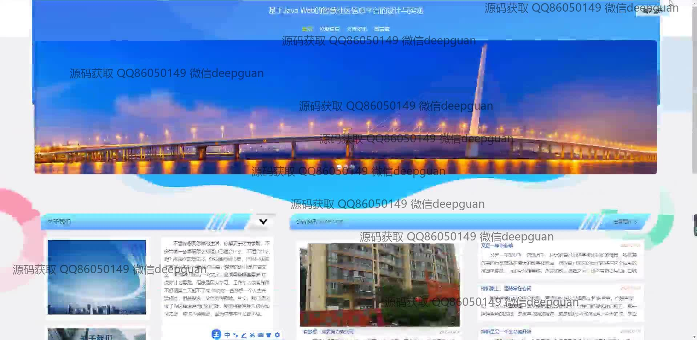
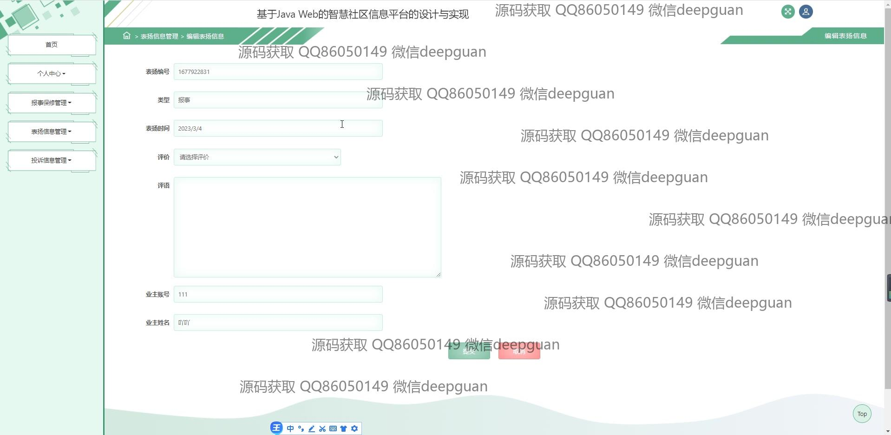

<h1 align="center">基于Java Web的智慧社区信息平台的设计与实现</h1>

## 简介
智慧社区信息平台：提供用户注册、登录、公告通知、留言反馈、报事报修管理、表扬投诉管理、垃圾分类、信息展示等功能，提升社区管理效率及用户体验。    --计算机毕业设计源码；毕设源码；java毕业设计源码

## 联系方式

<h3 align="center">获取完整代码与数据库文件 + 微信：deepguan QQ: 86050149 QQ群: 783742310</h3>

<h3 align="center">可帮忙远程部署 包运行成功！提供远程部署、修改代码、设计文档指导、代码讲解等服务！</h3>

## 功能介绍（完整见运行截图）
管理员：  
基本功能：支持登录、注册、退出以及账号权限管理。  
信息管理：可编辑公告信息、垃圾分类信息、投诉信息和表扬信息，支持增删改查和内容审核。  
系统管理：管理用户反馈、留言、报事报修以及垃圾信息评论，提升社区管理效率。  
导航功能：提供首页、个人中心、业主管理、系统信息管理等功能模块，方便模块化管理操作。

用户：  
基本功能：支持登录、注册、快速找回密码和身份选择（如业主、管理员）。  
信息服务：查看公告、新闻、活动信息以及垃圾分类展示，支持搜索和筛选功能。  
互动功能：提交投诉、表扬、留言及反馈信息，并支持图片上传和评价填写。  
个人中心：查看和编辑个人信息，查询历史记录及管理我的表扬、投诉等内容。

## 运行截图

本代码来源于网络,仅供学习参考使用!

